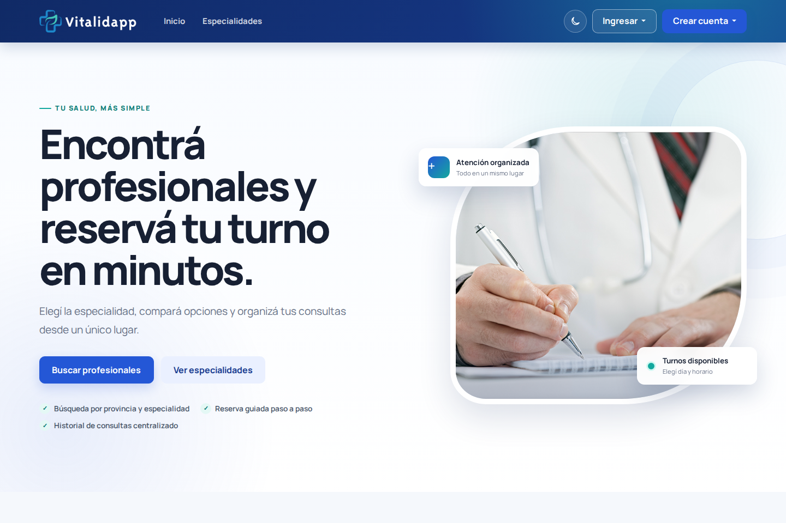
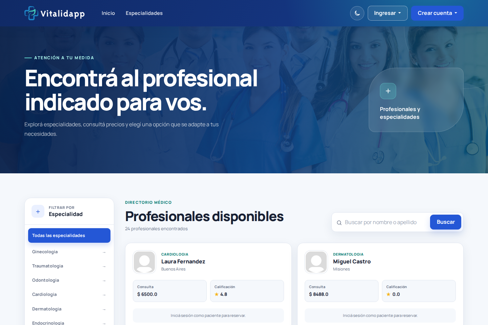
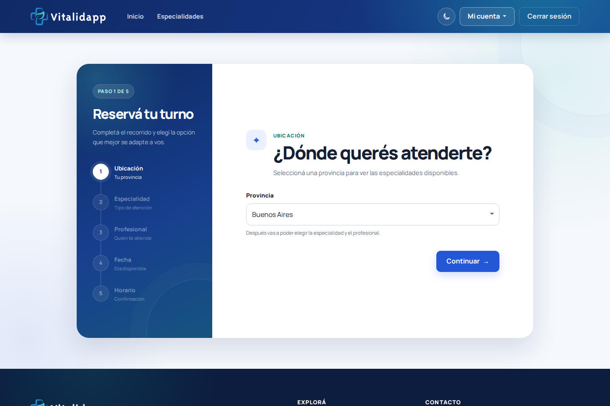
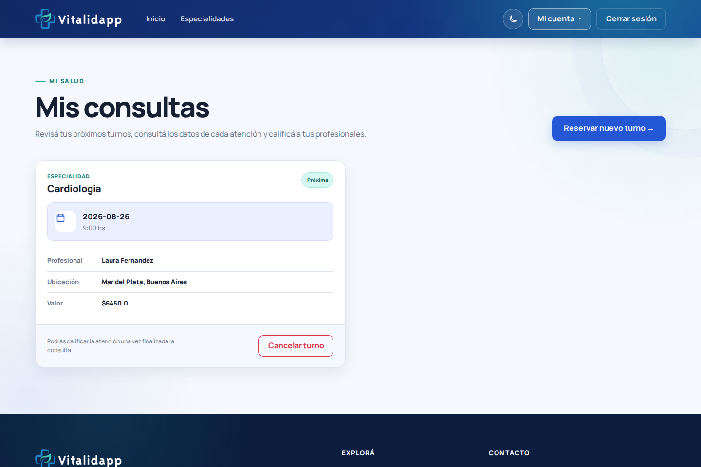
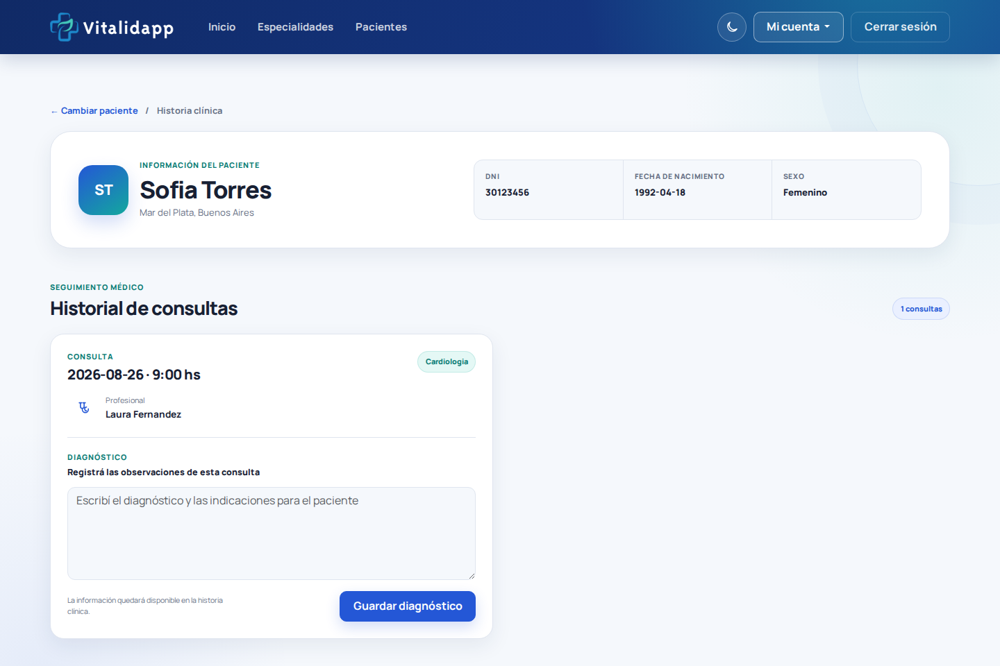
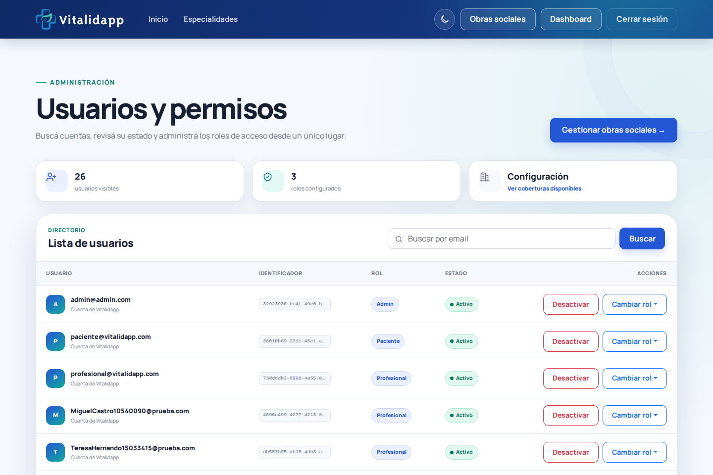
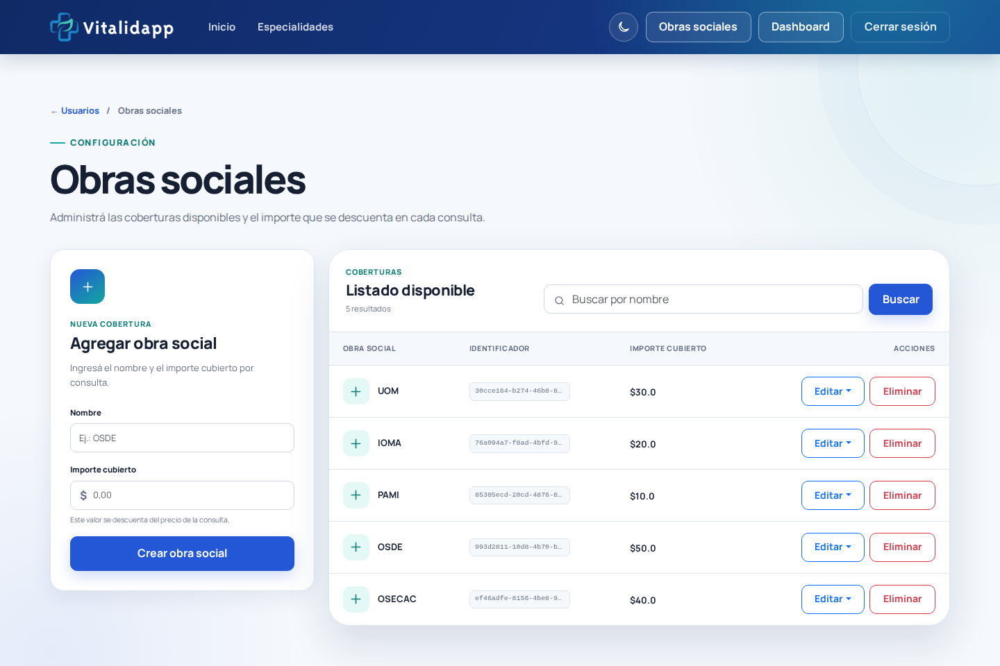
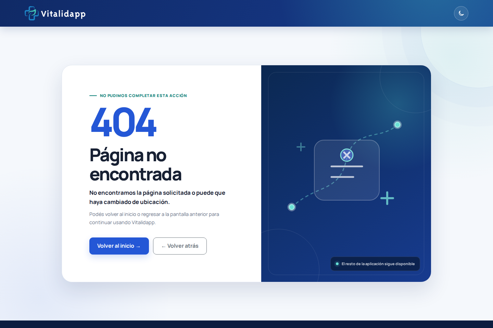
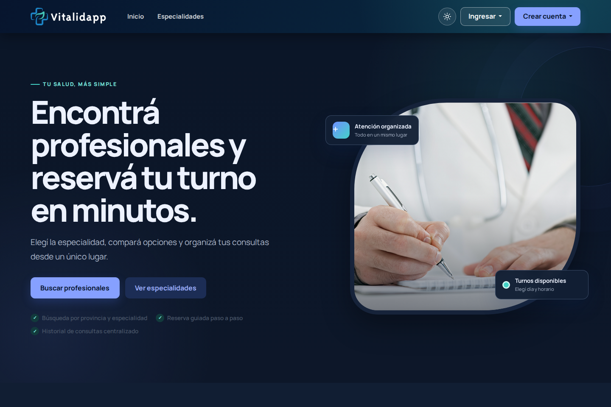

<p align="center">
  
</p>

<h1 align="center">Vitalidapp</h1>

<p align="center">
  A role-based healthcare web application for finding professionals, booking appointments and managing clinical follow-up.
</p>

<p align="center">
  <a href="https://github.com/MattVmx/vitalidapp/actions/workflows/ci.yml"></a>
  
  
  
  
</p>



## About the project

Vitalidapp connects patients with healthcare professionals and covers the complete appointment lifecycle: discovery, booking, follow-up, diagnosis and rating. Separate role-based areas keep patient, professional and administrator tasks focused and protected.

The application began as a six-person team project. My main contribution was frontend development, and I also served as Scrum Master. I later modernized the product for this portfolio version while preserving its original business logic: I added a zero-configuration demo, strengthened authorization, repaired the main user journeys and created a responsive visual system with light and dark themes.

## Product tour

### Professional discovery

Patients can explore available specialties, search professionals by first or last name and start a booking from the selected profile.



### Guided appointment booking

The reservation journey is split into five clear steps: province, specialty, professional, available date and time. Each screen preserves the current selection and only exposes valid options.



### Patient appointments

Patients can review upcoming and completed consultations, cancel future appointments and rate an appointment after it has taken place.



### Professional clinical follow-up

Professionals can access the patients linked to their appointments, review consultation history and record a diagnosis for each visit.



### Administration

Administrators can search accounts, review their status, activate or deactivate access and assign roles. A separate management area supports creating, editing, searching and deleting healthcare coverage providers.

<table>
  <tr>
    <td width="50%">
      
      <br><strong>User and role administration</strong>
    </td>
    <td width="50%">
      
      <br><strong>Healthcare coverage management</strong>
    </td>
  </tr>
</table>

### Consistent error states

Unexpected routes and server errors use the same responsive visual language and preserve the selected color theme.



### Light and dark themes

The color theme follows the browser preference on the first visit and can be changed at any time. The selected option is stored locally and shared across public and authenticated pages.



## Features by role

| Patient | Professional | Administrator |
| --- | --- | --- |
| Complete and edit a personal profile | Complete and edit a professional profile | Search and inspect registered accounts |
| Search by province and specialty | Configure specialty, availability and consultation price | Activate or deactivate users |
| Compare and select professionals | Review linked patients and their consultation history | Assign patient, professional or administrator roles |
| Reserve an available date and time | Record diagnoses | Create, edit, search and remove coverage providers |
| Review, cancel and rate appointments | Track ratings received | Access protected administration routes |

## Tech stack

| Layer | Technologies |
| --- | --- |
| UI | Thymeleaf, Bootstrap 5, HTML5, CSS3, JavaScript |
| Backend | Java, Spring Boot 2.7, Spring MVC, Spring Security |
| Persistence | Spring Data JPA, Hibernate |
| Databases | H2 for the demo profile, MySQL for the configurable profile |
| Quality | Maven Wrapper, Spring Boot Test, Spring Security Test, GitHub Actions |

The project runs with Java 17. Its Maven configuration keeps Java 8 source compatibility because the original application was created with that language level.

## Run the demo locally

### Requirements

- JDK 17
- Git
- No external database is required for the default demo profile

Clone the repository:

```bash
git clone https://github.com/MattVmx/vitalidapp.git
cd vitalidapp/health-service-app
```

On Windows PowerShell:

```powershell
.\mvnw.cmd spring-boot:run
```

On macOS or Linux:

```bash
bash mvnw spring-boot:run
```

Open [http://localhost:8181](http://localhost:8181).

### Demo accounts

| Role | Email | Password |
| --- | --- | --- |
| Patient | `paciente@vitalidapp.com` | `123456` |
| Professional | `profesional@vitalidapp.com` | `123456` |
| Administrator | `admin@admin.com` | `123456` |

These credentials are public and intended only for local demonstration. The H2 database and any changes made during a session are reset whenever the application restarts.

## Run with MySQL

Create the database with `health-service-app/script-mysql/healthservicedb.sql`, configure the connection variables and activate the `mysql` profile.

```bash
export SPRING_PROFILES_ACTIVE=mysql
export DB_URL='jdbc:mysql://localhost:3306/healthservicedb'
export DB_USERNAME='root'
export DB_PASSWORD='root'
bash mvnw spring-boot:run
```

Never commit real database credentials to the repository.

## Tests

Windows PowerShell:

```powershell
.\mvnw.cmd test
```

macOS or Linux:

```bash
bash mvnw test
```

GitHub Actions runs the test suite for every pull request and every push to `master`. The current smoke coverage verifies that the Spring context starts with the demo profile and that the public home page responds correctly.

## Architecture

```text
health-service-app/
├── src/main/java/.../
│   ├── controllers/    HTTP routes and role-specific flows
│   ├── entity/         JPA domain models
│   ├── repository/     Persistence queries
│   ├── security/       Spring Security configuration
│   └── service/        Business rules and orchestration
├── src/main/resources/
│   ├── static/         CSS, JavaScript and images
│   ├── templates/      Thymeleaf pages and shared fragments
│   └── application-*   Demo and MySQL profiles
└── src/test/           Automated smoke tests
```

## Demo scope

Vitalidapp is a portfolio case study and not a production medical platform. The demo uses fictional data and does not provide the regulatory, privacy, auditing or operational safeguards required for real healthcare information.
